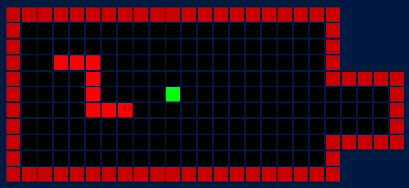

# Unity Group Project - CPSC 24500

Current game title: **The Great Snake Escape**

## Instructions 
To run this project, first `pull` this repository (or `clone` it if you are doing this for the first time). Then, open Unity Hub, browse to the project folder `unity-group-project/Unity Group Project`, and open it.

To commit to `README.md`, do the instructions above and `pull` the repository, make changes, and run `git commit -m "README" README.md` then `git push`.

## Role-specific instructions 
To **test the game**, you should `pull` the repository, build the project to a .exe, and test it (or play it in Unity).

To **design a map**, [to be determined]

For the **pixel art designer**, here are some of the 16x16 pixel art sprites that we need (make it kind of simple, similar to the ones that we have):
- Snake body sprite 
- Snake head sprite 
- Apple sprite 
- Potential item designs 
- Tile designs (optional)

## Game Progress 
- **(9/24/24)** Made a grid 
- **(9/25/24)** Made a player 
- **(9/26/24)** Made player movement 
- **(10/01/24)** Revamped tilemaps and made walls to work 
- **(10/01/24)** Made snake design and some core snake tile functionality 
- **(10/02/24), map designer** Added a room to the map as a test 
- **(10/04/24)** Made snake loading functionality 
- **(10/06/24)** Made snake moving functionality 
- **(10/06/24)** Made snake chase player in an easy manner 
- **(10/09/24)** Simple title screen prototype with scene switching 
- **(10/14/24)** Action tile prototype with gold counter 
- **(10/15/24)** Fail screen when snake catches you 

